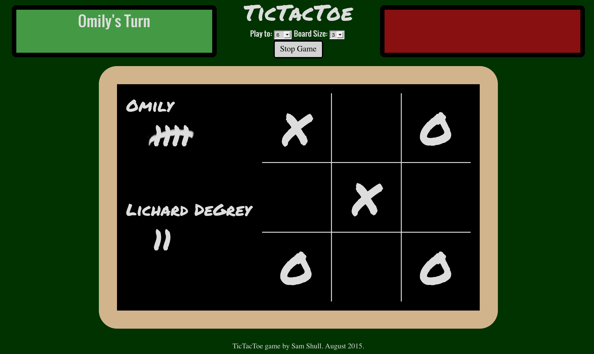
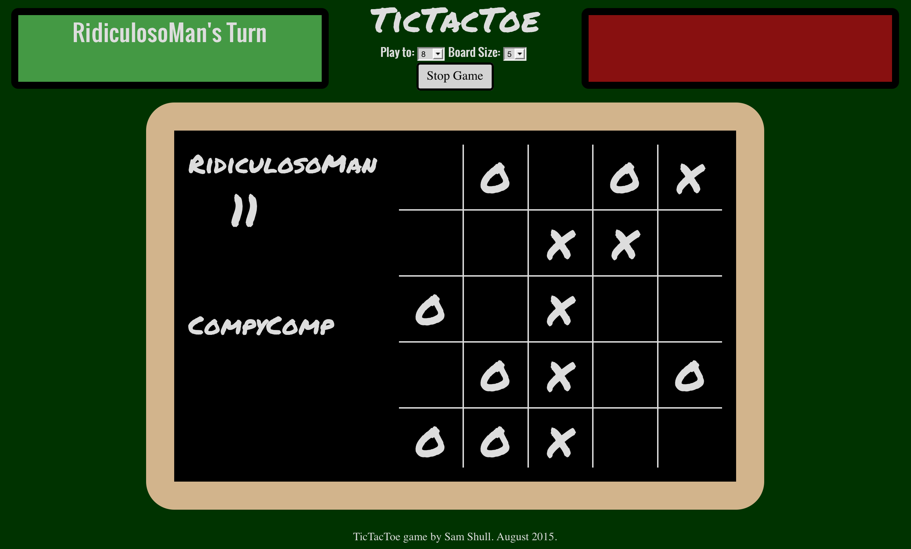

# TicTacToe

A standard 3x3 TicTacToe game

A 5x5 version of the game

I created a TicTacToe game that is scalable to any size board.  For the sake of screen real estate, I have limited the user selection to 3x3, 4x4, or 5x5 boards, but boards of any size are theoretically possible with some minor tweaks to the logic (see below).

Currently the AI logic consists of simple random square selection, so a human player can easily beat it.  In fact, a greater challenge for the player is to try and force the AI to win.  This is especially tricky on the larger 4x4 and 5x5 board sizes.  The AI can be assigned to either the first-move or second move positions for added variety and, of course, can be turned off altogether to allow two human users to play each other.

A tally-based score keeping system allows the user to "chalk-up" his or her wins off to the side of the game board, and to continue gameplay to a pre-selected number of wins, at which point a congratulatory screen appears.  After each round, the previous losing player gets to go first in the new round.

## User Stories (Pre-coding)
As preparation for this project, I brainstormed some user stories that I wanted to see implemented.  Most of these are now active in the game.  Some were later deemed unnecessary or left to be added/improved upon in future updates.

- As a user, I would like to be able to enter my name and the name of my opponent, and see that information displayed onscreen, so that I can keep track of when it is my turn and which symbol I am.

- As a user, I would like to be able to choose whether I go first or second, and what symbol I am going to be, so that there is variety of gameplay and I don't have to give up my lucky symbol.  Maybe even something other than X and O.

- As a user, I would like to be able to play "best of five" with alternation of who goes first, so that the game won't end in under a minute.

- As a user, I would like to be able to play against the computer, in case none of my friends are around (but I do have friends.  I do.  I swear!)

- As a computer, I would like to be given sufficient AI logic to win sometimes, so that I don't have to spend eternity feeling inferior to humans.

- As user, I would like to be able to choose a square during my turn by clicking on it, so that I don't have to play the game by typing in the Javascript console, which I don't know how to use.

- As a computer, I would like a countdown timer to challenge the human user to choose a square quickly when it is their turn.

## Game Win Logic
The game win logic in this game is based on a system of assigning ID numbers to each of the squares and evaluating the relationships between them.  Each square is given an ID formed from the concatenation of its row and column numbers into a 2 digit decimal integer.  For example, the first square in the first row is row 1 column 1, and therefore its ID is 11.  The third square in the second row is row 2 column 3, with an ID of 23.  With this particular numbering system, the largest possible board is 9x9 squares.  Using an index that starts at 0 would allow for 10x10, and multiplying the base number by 100 or 1000 (ex 1001, 1002, 1003, 1004) would allow for vastly larger sizes using essentially the same logic.  As I did not need any board size greater than 5x5, a simple 2 digit index starting at 1 was more than sufficient for my purposes.

The game determines whether or not a player has won by examining the collection of squares "owned" by the player at the end of each turn.  It looks for patterns in the differences between the IDs of each of the user's squares to try to find a pattern that would indicate a win.  For instance, a vertical win in the first column of a 3x3 board would include squares 11, 21, and 31.  When the two smaller IDs (11, 21) are subtracted from the largest (31), differences of 10 and 20 result.  Dividing the larger difference by the smaller yields a quotient of 2.  Such will be the case with any winning 3 square combination on a 3x3 board.  A vertical win will will differ by multiples of 10 (as in the above example 11, 21, 31).  A horizontal win will differ by multiples of 1 (21, 22, 23), while a diagonal win will differ by multiples of 9 or 11 depending on the direction of the slant (13, 22, 31 or 11, 22, 33, respectively).  

Applying this logic to the larger boards will result in a longer winning row and therefore more differences between winning squares.  There will always, however, be one less difference than there are squares in the row, and one less testable quotient than there are differences.  In a 4x4 board, therefore, the program must test for relationships between the differences by factors of 2 AND 3, and in a 5x5 board by factors of 2, 3, and 4.  This is accomplished through a mind-numbing set of nested for-loops that is difficult to follow at first, but gets the job done without needing any modification to the check function for the different size game boards.
